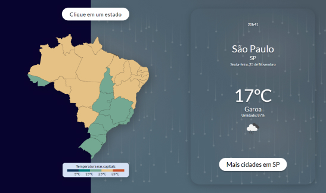

  
  <h3 align="center">weather-app-brasil-build</h3>
  <a href="https://vitorfontenele.github.io/weather-app-brasil-build/">https://vitorfontenele.github.io/weather-app-brasil-build/</a>

<!-- Conteúdo -->

  
Conteúdo

  <ol>
    <li><a href="#sobre-o-projeto">Sobre o projeto</a></li>
    <li><a href="#contato">Contato</a></li>
  </ol>

<!-- SOBRE O PROJETO -->
## Sobre o projeto

Este é o repositório utilizado para o deploy do Weather App Brasil, cujo repositório original de desenvolvimento encontra-se neste [link](https://github.com/vitorfontenele/weather-app-brasil).

(<a href="#readme-top">voltar para o topo</a>)

<!-- CONTATO -->
## Contato

[![Github][github-shield]][github-url][![Linkedin][linkedin-shield]][linkedin-url]

Link do Projeto: [https://github.com/vitorfontenele/weather-app-brasil-build](https://github.com/vitorfontenele/weather-app-brasil-build)

(<a href="#readme-top">voltar para o topo</a>)

<!-- MARKDOWN LINKS & IMAGES -->
[linkedin-shield]: https://img.shields.io/badge/LinkedIn-0077B5?style=for-the-badge&logo=linkedin&logoColor=white
[linkedin-url]: https://www.linkedin.com/in/vitor-fontenele/
[github-shield]: https://img.shields.io/badge/GitHub-100000?style=for-the-badge&logo=github&logoColor=white
[github-url]: https://github.com/vitorfontenele
